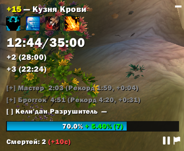
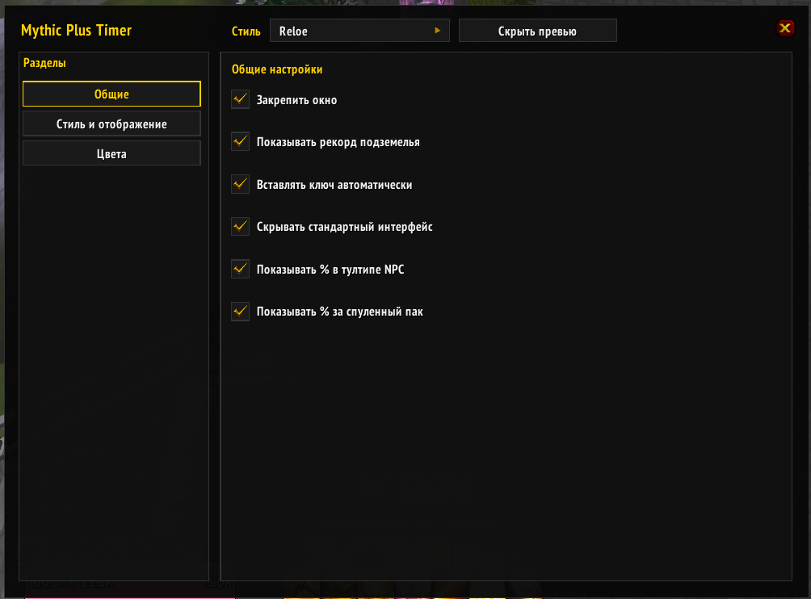

# MythicPlus Timer

Таймер и трекер для Mythic+ подземелий на **Sirus** (WotLK 3.3.5a). Аддон заменяет стандартное окно M+ и даёт кастомные настройки и дополнительную информацию, недоступную в стандартном окне.

## Описание

MythicPlus Timer подменяет стандартный интерфейс ключа на Sirus: вместо встроенного окна отображается компактное перетаскиваемое текстовое окно с таймером, прогрессом по мобам, боссам и смертям. Настройки аддона открываются в разделе «Интерфейс → Модификации» и позволяют настроить отображение таймера, прогресс-бара, аффиксов и масштаб всего окна.

## Окно таймера (замена стандартного M+ интерфейса)

Окно показывает всю ту же информацию, что и стандартный интерфейс, но с дополнительными фишками:
- Таймер убийства босса и рекорды (рекорд на конкретном уровне ключа).
- Точный таймер прохождения босса на +2/+3.
- Подсчет точного текущего числа процентов за убитых NPC (без округления до целого числа).
- Подсчет процентов за текущий спуленный пак.
- Возможность перенести окно в любое место.
- Возможность свернуть все окно в одну строку.
- Кнопки паузы/продолжения и сдачи прямо в интерфейсе.

Свернутая версия:

### Панель настроек

Кастомные настройки: 
- Закрепление окна. 
- Режим отладки. 
- Показ рекорда подземелья.
- Авто-вставка ключа при открытии окна.
- Обратный таймер (начинается с 00:00).
- Кастомный шрифт на выбор. 
- Выбор прогресса полосой/текстом. 
- Отображение аффиксов текстом или иконками c описанием.
- Превью окна аддона.

## Установка

1. Скачайте архив или клонируйте репозиторий.
2. Скопируйте папку `MythicPlusTimer` в `Interface\AddOns` вашего клиента WoW (Sirus).
3. Если есть приписка `-main` - необходимо ее удалить.
4. Перезапустите игру или выполните `/reload`.

## Использование

- Окно таймера можно перетаскивать; в настройках можно включить «Закрепить окно».
- Команды: `/mpt` — список команд, `/mpt timer` — показать/скрыть таймер, `/mpt preview` — превью, `/mpt debug` — режим отладки.

## Требования

- WoW WotLK 3.3.5a (клиент Sirus).
